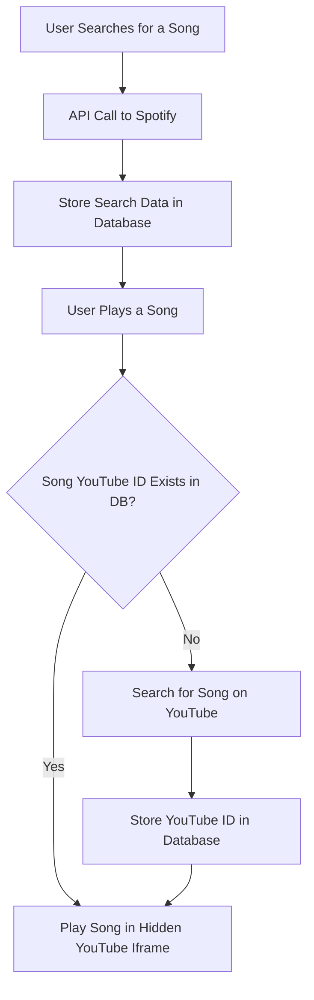
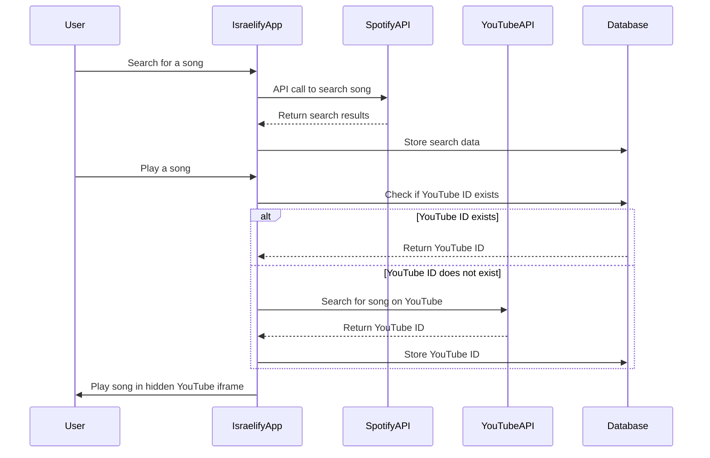

# IsraelifyApp


[Deployed Version](https://israelify.onrender.com/) | [Backend Repository](https://github.com/barmoshe/Israelify-backend)
<br/>

<br/>

IsraelifyApp is the final project of the Fullstack Development course at Coding Academy. This project is a Spotify web clone with additional unique features.


## Table of Contents
- [IsraelifyApp](#israelifyapp)
  - [Table of Contents](#table-of-contents)
  - [Project Overview](#project-overview)
  - [Features](#features)
  - [Installation](#installation)
  - [Technologies Used](#technologies-used)
  - [Music Playback Flow](#music-playback-flow)
  - [Contact](#contact)
  

## Project Overview

Israelify is a music streaming platform that allows users to explore, listen to, and create playlists of their favorite songs. The name "Israelify" is derived from combining "Israel" and "Spotify." This application mimics the user experience and functionality of Spotify. Developed as the final project in the Fullstack Development course at Coding Academy, the primary goal was to apply the knowledge and skills acquired during the course to build a fully functional web application.

## Features

- **Music Library**: Browse and search a vast collection of songs from all around the world.
- **Playlists**: Create, edit, and share playlists.
- **Real-time Playback**: Enjoy seamless music playback with a user-friendly player.
- **Responsive Design**: Optimized for both desktop and mobile devices.
- **Interactive UI**: Intuitive and interactive user interface for an enhanced user experience.
- **Editing Playlists Together**: Use socket connections to create and edit shared playlists in real time.
- **AI Integration**: Use OpenAI to generate playlists according to user voice or text prompts.

## Installation

To run this project locally, follow these steps:

1. **Clone the repository:**
    ```sh
    git clone https://github.com/Gal-Or/IsraelifyApp.git
    cd IsraelifyApp
    ```

2. **Install dependencies:**
    ```sh
    npm install
    ```

3. **Set up environment variables:**
    Create a `.env` file with the following variables:
    ```env
    VITE_SPOTIFY_CLIENT_ID=your_spotify_client_id
    VITE_SPOTIFY_CLIENT_SECRET=your_spotify_client_secret
    VITE_YOUTUBE_API_KEY=your_youtube_api_key
    VITE_NODE_ENV=development
    ```

4. **Run the application:**
    ```sh
    npm run dev
    ```

5. **Access the application:**
    Open your browser and navigate to `http://localhost:5173`

## Technologies Used

- **Frontend:**
  - React
  - Redux
  - SCSS
  - React Router
  - HTML

- **Backend:**
  - Node.js
  - Express
  - MongoDB
  
- **Other Tools:**
  - Browser API
  - Babel
  - Spotify Web API
  - YouTube Data API 
  - OpenAI API


## Music Playback Flow



<hr> 




## Contact

For any questions or suggestions, please contact us at:

- **Gal**
  - **Email**: Galor.dvlp@gmail.com
  - **GitHub**: [Gal-Or](https://github.com/Gal-Or)

- **Bar**
  - **Email**: 1barmoshe1@gmail.com
  - **GitHub**: [Bar-Moshe](https://github.com/barmoshe)

  ---

Thank you for visiting the Israelify repository! We hope you enjoy using our music streaming platform.

